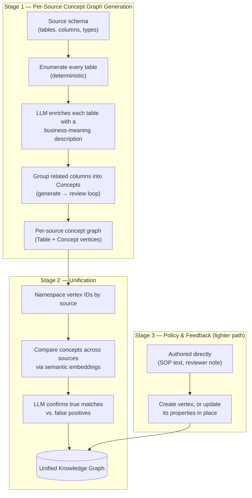
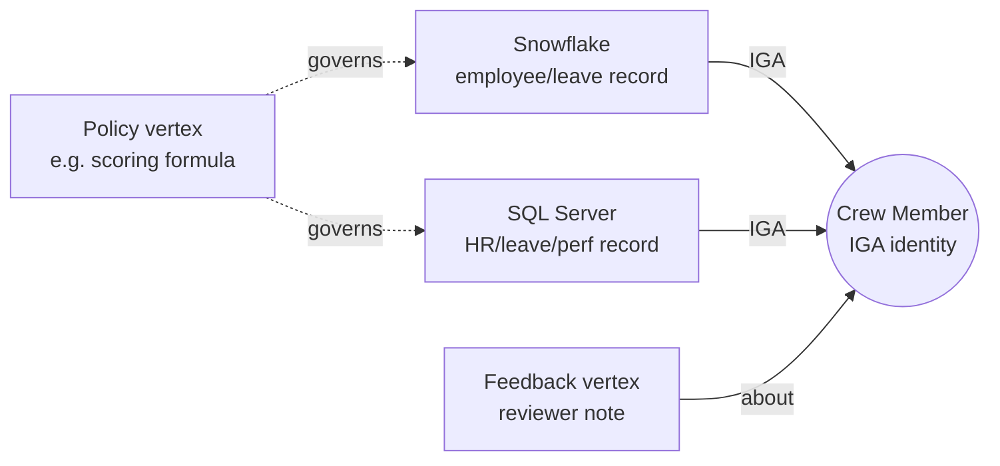
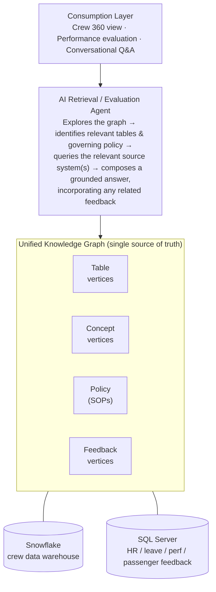

# Crew 360 Knowledge Graph — High-Level Design

**Status:** Draft
**Audience:** Engineering, Data, HR/Ops stakeholders

---

## 1. Purpose & Vision

The objective is a single, unified knowledge layer for everything related to crew — one place
that ties together *where the data lives*, *what rules govern it*, and *what people say about
it*, all correlated around each crew member's identity. This layer is what an AI agent (or a
human) queries to evaluate crew performance holistically, rather than having to separately check
a data warehouse, a policy document, and someone's email thread.

The knowledge graph itself does not attempt to *store* all crew data. It stores the **schema,
relationships, policies, and correlation keys** that let every source system — however many there
end up being — be navigated as if they were one system.

## 2. Current State

What exists today, as a starting point for this design:

- **Data**: Crew HR, leave (CLMS), performance (IJP), and passenger-feedback (NPS) data, sourced
  from Excel exports, loaded into a single SQL Server database as four related tables.
- **Knowledge graph**: An Azure Cosmos DB (Gremlin) graph mirrors this schema — one vertex per
  physical table (tagged with its source system), plus "Concept" vertices that group related
  columns together for semantic discovery.
- **Policy layer**: Crew SOPs (leave management, performance scoring, disciplinary escalation,
  IJP eligibility, etc.) live in the *same* graph as a third vertex type — not duplicated in
  application code or prompts. Where a policy involves a calculation (e.g. the weighted
  performance-scoring formula), the graph vertex holds the actual weights/thresholds as
  structured data — editing that single vertex changes the computed outcome everywhere,
  immediately, with no code change.
- **Retrieval agent**: An AI agent explores the graph first to work out which tables and policies
  are relevant, executes the necessary query against the physical database, applies whatever
  policy governs the question, and composes a plain-language answer grounded in both.
- **Correlation key**: `IGA` (a unique crew identifier) is the join key shared by every table
  today.

This design proposes extending that same model in two directions: a new physical data source
(Snowflake), and a new kind of knowledge the graph hasn't captured before (human feedback).

## 3. How the Concept Graph Is Built

The Table and Concept vertices described above aren't hand-modeled — they're generated from each
source's schema by a dedicated LLM pipeline, then merged. Understanding this two-stage process
matters for this design because it's exactly what onboarding Snowflake reuses, and it's why
Policy and Feedback are deliberately handled a different, lighter way (Stage 3 below).

**Stage 1 — Per-source concept graph generation.** For each data source individually, a
graph-building agent is given that source's schema (its tables, columns, data types, and any
available descriptions) and works through it in a few passes:

1. Every table is enumerated deterministically first, so none are silently missed.
2. For each table, an LLM reasons about what the table is *for* and what its columns mean in
   business terms — not just their raw names — and produces an enriched, human-readable
   description.
3. A second pass looks across all the enriched tables and groups related columns into
   higher-level **Concepts** — for example, several columns spread across multiple tables that
   all describe "Employee Identity" get recognized as one concept, even though no single table
   captures it alone. This runs as a generate-then-review loop: one pass proposes the concept
   grouping, a second critiques and refines it before anything is accepted.
4. The output is a self-contained concept graph for that one source — Table vertices and Concept
   vertices, connected by relationship edges — saved as an intermediate result before it touches
   the live graph at all.

**Stage 2 — Unification.** Once every source has its own concept graph, a separate unification
pass combines them into one:

- Every vertex ID is namespaced by its source of origin, so identically-named things from two
  different sources never collide.
- Concepts from different sources are compared using semantic embeddings, so two concepts with
  different names but the same underlying meaning (say, "Employee Identity" in one source and
  "Crew Identity" in another) are flagged as likely duplicates — an LLM makes the final call on
  whether they should actually be merged into one concept or kept distinct.
- The merged result becomes the single unified graph — the one the retrieval agent actually
  queries against.

**Stage 3 — Policy and Feedback are handled differently, deliberately.** Table and Concept
vertices are *derived* from a schema, so regenerating them through the pipeline above makes
sense. Policy and Feedback vertices are not derived from any schema — they're authored directly
(an SOP a human wrote, a note a reviewer typed) — so they're written to the graph through a
simpler, purely additive path instead: a vertex is created if it doesn't exist, or its properties
are updated in place if it does, with no regeneration step. This distinction also matters
operationally: unification (Stage 2) replaces everything for the sources it touches, which is not
something to run casually against a live graph — additive updates are, and are how policy and
feedback stay current without disturbing anything else already in the graph.

## 4. Proposed Extension: Snowflake as a Data Source

Today's Excel-sourced tables move into Snowflake, structured the same way per data domain (crew
HR, leave, performance, feedback, and any future domains). Onboarding Snowflake into the
knowledge graph reuses Stage 1 + Stage 2 from §3 exactly as-is: Snowflake's schema goes through
the same per-source concept-graph generation, then the same unification pass merges its Table and
Concept vertices into the existing graph — tagged with its own source-system label, using the
same semantic-matching step to connect its concepts to equivalent ones already discovered in
SQL Server. The graph does not distinguish "old" and "new" data by how it's explored; only by
where the underlying query eventually runs.

**A constraint worth naming up front**: Snowflake and SQL Server are different database engines.
Data in one cannot be joined to data in the other within a single query the way today's system
joins multiple SQL Server tables together. This needs a deliberate answer, not an assumption —
see the open questions in §9.

## 5. Proposed Extension: User Feedback Layer

A new vertex type — **Feedback** — persists qualitative human input directly in the graph: a
reviewer's note on why a score felt off, a correction to a data point, a manager's observation
that no source system tracks. Feedback vertices are attributed to a crew member (via `IGA`) and
linked to whatever they're about — a specific data point, a policy, or a prior evaluation.

This is the piece that turns the knowledge graph from a read-only mirror of source systems into a
living record that also captures things no source system was ever designed to hold. Answering
"how is this person performing" then means the data *and* the human context that surrounds it are
retrieved together, not separately.

## 6. Unified Correlation Model

`IGA` is the backbone identity key. Every vertex that pertains to a crew member — regardless of
whether it originated in Snowflake, SQL Server, a policy document, or a piece of feedback — is
reachable by following relationships out from that person's identity. The graph doesn't need to
know in advance every possible question that might be asked; it needs every relevant fact to be
*reachable* from the crew member it's about.

*Every fact about one crew member — wherever it originated — is reachable by following edges out
from that person's identity, rather than having to know in advance which source system holds it.*

## 7. Architecture

*All four vertex types are linked by relationship edges (governs, relates-to, ...) and correlated
around crew identity (`IGA`), regardless of which physical system — Snowflake or SQL Server —
they describe.*

## 8. Design Principles

| Principle | What it means in practice |
|---|---|
| Graph as source of truth for **schema, policy, and relationships** — not raw data | Operational data stays in its system of record; the graph indexes and connects it, it doesn't duplicate it |
| Additive, non-destructive change | New sources, policies, or feedback are added to the graph without disrupting what's already there |
| Deterministic computation for anything requiring correctness at scale | Calculated policy (e.g. scoring) is computed by code reading parameters from the graph, not re-derived by an LLM each time — reliability and consistency over flexibility where it counts |
| One identity key as the correlation backbone | `IGA` ties every source, every policy, and every piece of feedback back to a single crew member |
| Uniform discoverability | Every vertex type is searchable the same way, so adding a new type (like Feedback) doesn't require new retrieval logic |

## 9. Open Design Questions

- **Cross-source querying**: how does the agent answer a question that spans Snowflake and SQL
  Server data in one response — a federated/virtual query layer, scheduled replication into one
  operational store, or the agent querying each source separately and correlating results by
  `IGA` afterward?
- **Feedback provenance**: where does feedback get entered from (a UI, an API, manual entry), and
  does it need review/approval before it can influence an evaluation?
- **Feedback authority**: should feedback ever be allowed to override a computed policy result, or
  should it only ever supplement it as context alongside the number?
- **Versioning & audit**: how are changes to policy (SOPs) and feedback entries tracked over time —
  who changed what, when, and why?
- **Access control**: who can read or write each vertex type, particularly Feedback, which may
  contain sensitive human judgment about individuals.

## 10. Summary

The goal is one graph that ties together *where the data lives* (Snowflake, SQL Server, and
whatever comes next), *what rules apply to it* (Policy/SOP), and *what people say about it*
(Feedback) — all correlated by crew identity. A single question about a crew member's performance
should be answerable with full context, regardless of which system originally held the underlying
fact.
