# Indigo Knowledge Graph - Infrastructure Guide

Complete guide for deploying and managing the Indigo Knowledge Graph infrastructure on Azure.

## 📐 Architecture Overview

### Multi-Layered Architecture

```mermaid
graph TB
    subgraph presentation[" Presentation Layer "]
        USER["User/Client"]
    end
    
    subgraph webapp[" Web Application Layer - Flask "]
        WEBAPP["End-User Web App<br/>Flask Application"]
        BASIC["Basic Inference Agent<br/>Simple KG Queries"]
        STANDARD["Standard Inference Agent<br/>Single-Path Traversal"]
        TREE["Tree Inference Agent<br/>Multi-Threaded"]
        DATA["Data Retrieval Agent<br/>Physical DB Queries"]
        
        WEBAPP --> BASIC
        WEBAPP --> STANDARD
        WEBAPP --> TREE
        WEBAPP --> DATA
    end
    
    subgraph application[" Infrastructure Layer - Azure Container Apps "]
        BUILDER["Graph Builder Agent<br/>Container App"]
        UNIFIER["Graph Unifier Agent<br/>Container App"]
    end
    
    subgraph aiservices[" AI Services Layer "]
        AOAI["Azure OpenAI<br/>GPT Deployment"]
        EMBED["Embeddings<br/>Embedding Model"]
        FOUNDRY["Azure AI Foundry<br/>Project Workspace"]
    end
    
    subgraph data[" Data Layer "]
        COSMOS["Cosmos DB Gremlin<br/>Graph Database"]
        NEO4J["Neo4j<br/>Optional"]
        SQLDB["SQL Server<br/>Physical Databases"]
    end
    
    subgraph platform[" Platform Layer "]
        ACR["Azure Container Registry<br/>Docker Images"]
        KV["Key Vault<br/>Secrets"]
        INSIGHTS["Application Insights<br/>Monitoring"]
        LOGS["Log Analytics<br/>Centralized Logs"]
    end
    
    subgraph sources[" Input Data Sources "]
        CLMS["Database 1<br/>Schema CSV"]
        CREW["Database 2<br/>Schema CSV"]
        PEP["Database 3<br/>Schema CSV"]
    end
    
    USER -->|HTTPS| WEBAPP
    USER -->|HTTPS| BUILDER
    USER -->|HTTPS| UNIFIER
    
    BASIC -->|Query KG| COSMOS
    STANDARD -->|Query KG| COSMOS
    TREE -->|Query KG| COSMOS
    DATA -->|Query KG| COSMOS
    DATA -->|Query Data| SQLDB
    
    BASIC -->|LLM Calls| AOAI
    STANDARD -->|LLM Calls| AOAI
    TREE -->|LLM Calls| AOAI
    DATA -->|LLM Calls| AOAI
    
    BUILDER -->|Graph Queries| COSMOS
    BUILDER -->|Optional| NEO4J
    BUILDER -->|LLM Calls| AOAI
    BUILDER -->|Embeddings| EMBED
    
    UNIFIER -->|Merge Graphs| COSMOS
    UNIFIER -->|LLM Calls| AOAI
    UNIFIER -->|Embeddings| EMBED
    
    CLMS -->|CSV Input| BUILDER
    CREW -->|CSV Input| BUILDER
    PEP -->|CSV Input| BUILDER
    
    BUILDER -->|Logs| INSIGHTS
    UNIFIER -->|Logs| INSIGHTS
    WEBAPP -->|Logs| INSIGHTS
    INSIGHTS -->|Aggregation| LOGS
    
    BUILDER -.->|Managed Identity| KV
    UNIFIER -.->|Managed Identity| KV
    
    ACR -->|Pull Images| BUILDER
    ACR -->|Pull Images| UNIFIER
    
    AOAI -.->|Part of| FOUNDRY
    EMBED -.->|Part of| FOUNDRY
    
    style WEBAPP fill:#E91E63,stroke:#333,stroke-width:2px,color:#fff
    style BASIC fill:#9C27B0,stroke:#333,stroke-width:1px,color:#fff
    style STANDARD fill:#9C27B0,stroke:#333,stroke-width:1px,color:#fff
    style TREE fill:#9C27B0,stroke:#333,stroke-width:1px,color:#fff
    style DATA fill:#9C27B0,stroke:#333,stroke-width:1px,color:#fff
    style BUILDER fill:#4CAF50,stroke:#333,stroke-width:2px,color:#fff
    style UNIFIER fill:#4CAF50,stroke:#333,stroke-width:2px,color:#fff
    style AOAI fill:#2196F3,stroke:#333,stroke-width:2px,color:#fff
    style COSMOS fill:#FF9800,stroke:#333,stroke-width:2px,color:#fff
    style ACR fill:#9C27B0,stroke:#333,stroke-width:2px,color:#fff
```



### Component Details

|Layer|Component|Purpose|Deployment|Status|
|-----|---------|-------|----------|------|
|**Web Application**|End-User Web App|Flask web interface with multiple agent views|Local/Azure App Service|✅ Available|
|**Web Application**|Basic Inference Agent|Simple knowledge graph concept lookups|Embedded in Web App|✅ Available|
|**Web Application**|Standard Inference Agent|Single-path depth-first graph traversal|Embedded in Web App|✅ Available|
|**Web Application**|Tree Inference Agent|Multi-threaded parallel graph exploration|Embedded in Web App|✅ Available|
|**Web Application**|Data Retrieval Agent|Queries physical databases using KG metadata|Embedded in Web App|✅ Available|
|**Infrastructure**|Graph Builder Agent|Analyzes database schemas, builds concept graphs|Azure Container Apps|✅ Deployed|
|**Infrastructure**|Graph Unifier Agent|Merges multiple concept graphs using embeddings|Azure Container Apps|✅ Deployed|
|**Integration**|Foundry Custom Connections|Registered agents for Prompt Flow workflows|Azure AI Foundry|✅ Registered|
|**AI Services**|Azure OpenAI|LLM for concept extraction and reasoning|Managed Service|✅ Existing|
|**AI Services**|Text Embeddings|Vector embeddings for semantic search|Managed Service|✅ Existing|
|**AI Services**|Foundry Project|ML workspace and model management|Managed Service|✅ Existing|
|**Data**|Cosmos DB Gremlin|Primary graph database (production)|Managed Service|✅ Deployed|
|**Data**|SQL Server|Physical databases (HRData, IJP, CLMS, PEP)|External/Local|✅ Required|
|**Data**|Neo4j|Optional graph database (legacy support)|Azure Container Instance|⚠️ Optional|
|**Platform**|Container Registry|Docker image storage|Managed Service|✅ Deployed|
|**Platform**|Key Vault|Secrets management|Managed Service|✅ Deployed|
|**Platform**|App Insights|Application monitoring|Managed Service|✅ Deployed|
|**Platform**|Log Analytics|Centralized logging|Managed Service|✅ Deployed|

---

## 🏛️ Agent Architecture & Deployment Models

The Indigo Knowledge Layer system consists of **6 specialized agents** deployed in two different models:

### Infrastructure Agents (Container Apps)

These agents run as independent Azure Container Apps and are registered as custom connections in Azure AI Foundry:

| Agent | Purpose | API Endpoint | Dockerfile |
|-------|---------|--------------|------------|
| **Graph Builder** | Extracts concepts and relationships from database schemas | `/score` | `Dockerfile.graph-builder` |
| **Graph Unifier** | Merges multiple concept graphs using semantic matching | `/score` | `Dockerfile.graph-unifier` |

**Deployment:** Azure Container Apps (scalable, managed, with health checks)  
**Access:** REST API endpoints or Azure AI Foundry custom connections  
**Use Case:** Building and maintaining the unified knowledge graph

### Query/Inference Agents (Web Application)

These agents run as part of the Flask web application and provide different query interfaces:

| Agent | Purpose | Web Route | Complexity |
|-------|---------|-----------|------------|
| **Basic Inference** | Simple concept lookups and direct KG queries | `/basic` | Low |
| **Standard Inference** | Single-path depth-first graph traversal | `/` | Medium |
| **Tree Inference** | Multi-threaded parallel exploration of concepts | `/advanced` | High |
| **Data Retrieval** | Queries physical databases using KG metadata, generates SQL | `/data` | High |

**Deployment:** Local development server or Azure App Service  
**Access:** Web browser interface with Server-Sent Events (SSE) for real-time updates  
**Use Case:** End-user querying and data retrieval

### Agent Selection Guide

**Use Infrastructure Agents (Container Apps) when:**
- Building or rebuilding the knowledge graph from schemas
- Merging multiple concept graphs
- Integrating with Azure AI Foundry workflows
- Need programmatic API access
- Orchestrating with Prompt Flow

**Use Query/Inference Agents (Web App) when:**
- End-users need to query the knowledge graph
- Retrieving actual data from physical databases
- Interactive exploration of concepts and relationships
- Testing different query strategies (basic vs tree)
- Need visual feedback during agent reasoning

---

## 🚀 Quick Start

### Prerequisites

- ✅ **Azure CLI** installed and authenticated (`az login`)
- ✅ **PowerShell 7+** for deployment scripts
- ✅ **Docker Desktop** (optional, for local testing)
- ✅ **Python 3.11+** (for running agents locally)
- ✅ **Git** for version control

### One-Command Deployment

```powershell
# Navigate to infrastructure folder
cd infra

# Run unified deployment script
.\deploy-all.ps1

# Optional: Deploy to Container Apps
.\deploy-agents-to-container-apps.ps1

# Optional: Register in Azure AI Foundry
.\register-foundry-connections.ps1
```

**What deploy-all.ps1 does:**

1. ✅ Validates `.env` configuration
2. ✅ Deploys Azure infrastructure (Cosmos DB, ACR, Key Vault, monitoring)
3. ✅ Prompts for optional Neo4j deployment
4. ✅ Updates `.env` with connection strings
5. ✅ Displays deployment summary and next steps

**Container Apps deployment adds:**

1. 🔨 Builds Docker images
2. 📤 Pushes to Azure Container Registry
3. 🌐 Creates Container Apps Environment
4. 🚀 Deploys both agents as running services

**Foundry registration enables:**

1. 🔌 Registers agents as custom connections
2. 📊 Enables Prompt Flow integration
3. 📓 Allows notebook testing in Azure ML Studio

---

## 🌐 Web Application Deployment

The Flask web application hosts the inference and data retrieval agents, providing an interactive interface for querying the knowledge graph.

### Local Development

```powershell
# Install dependencies
pip install -r requirements.txt

# Configure environment
# Ensure .env has COSMOS_DB_ENDPOINT, AZURE_OPENAI_ENDPOINT, SQL_SERVER_HOST, etc.

# Run web application
python -m src.end-user-app.app

# Or specify graph backend explicitly
python -m src.end-user-app.app --graph-backend cosmos
python -m src.end-user-app.app --graph-backend neo4j
```

**Access the interfaces:**
- **Basic Interface:** http://localhost:5000/basic (Simple KG queries)
- **Standard Interface:** http://localhost:5000/ (Single-path traversal)
- **Advanced Interface:** http://localhost:5000/advanced (Multi-threaded)
- **Data Retrieval:** http://localhost:5000/data (Physical DB queries)

### Deploy to Azure App Service (Optional)

```powershell
# Create App Service plan
az appservice plan create `
  --name indigo-kg-webapp-plan `
  --resource-group $AZURE_RESOURCE_GROUP `
  --location $AZURE_LOCATION `
  --sku B1 `
  --is-linux

# Create web app
az webapp create `
  --name indigo-kg-webapp `
  --resource-group $AZURE_RESOURCE_GROUP `
  --plan indigo-kg-webapp-plan `
  --runtime \"PYTHON:3.11\"

# Configure app settings from .env
az webapp config appsettings set `
  --name indigo-kg-webapp `
  --resource-group $AZURE_RESOURCE_GROUP `
  --settings @appsettings.json

# Deploy code
cd ..
zip -r webapp.zip . -x \"*.git*\" \"*__pycache__*\" \"*.venv*\"
az webapp deployment source config-zip `
  --name indigo-kg-webapp `
  --resource-group $AZURE_RESOURCE_GROUP `
  --src webapp.zip
```

### Test the Web Application

```bash
# Test Basic Inference Agent
curl http://localhost:5000/query -X POST \
  -H "Content-Type: application/json" \
  -d '{\"query\": \"What is Employee concept?\", \"backend\": \"cosmos\"}'

# Test Data Retrieval Agent
curl http://localhost:5000/query -X POST \
  -H "Content-Type: application/json" \
  -d '{\"query\": \"Get all employees from HRData with their leave balance\"}'
```

---

## 📦 Testing All Agents

### Test Infrastructure Agents (Container Apps)

**Graph Builder:**
```powershell
$body = @{database=\"Database1\"; skip_neo4j=$true} | ConvertTo-Json
Invoke-RestMethod -Uri https://your-builder-app.azurecontainerapps.io/score `
  -Method POST -Body $body -ContentType 'application/json'
```

**Graph Unifier:**
```powershell
$body = @{
    graph1=\"output/database1_concept_graph.json\";
    graph2=\"output/database2_concept_graph.json\"
} | ConvertTo-Json
Invoke-RestMethod -Uri https://your-unifier-app.azurecontainerapps.io/score `
  -Method POST -Body $body -ContentType 'application/json'
```

### Test Query/Inference Agents (Web App)

**Basic Inference:**
```bash
# Visit http://localhost:5000/basic
# Query: \"What tables are in the CLMS database?\"
```

**Standard Inference:**
```bash
# Visit http://localhost:5000/
# Query: \"Show me the relationship between Employee and Department\"
```

**Tree Inference (Multi-threaded):**
```bash
# Visit http://localhost:5000/advanced
# Query: \"Find all concepts related to Employee Performance\"
```

**Data Retrieval:**
```bash
# Visit http://localhost:5000/data
# Query: \"Get performance score for employee Akash Saxena\"
# Agent will generate SQL queries and retrieve actual data
```

### Test Employee Scoring Feature

```powershell
# Calculate performance score
python test_employee_scoring.py --name \"Akash Saxena\"

# By IGA number
python test_employee_scoring.py --iga 62913

# JSON output
python test_employee_scoring.py --name \"Kamal Choudhury\" --json
```

---

## 📋 Configuration

### Required .env File

Create a `.env` file in the project root with these values:

```env
# ============================================================================
# Azure Deployment Configuration
# ============================================================================
AZURE_SUBSCRIPTION_ID=your-subscription-id
AZURE_RESOURCE_GROUP=your-resource-group
AZURE_LOCATION=your-region

# ============================================================================
# Existing Azure AI Foundry Project
# ============================================================================
AZURE_AI_PROJECT_NAME=your-foundry-project-name
AZURE_AI_PROJECT_ID=your-project-id
AZURE_AI_PROJECT_RESOURCE_GROUP=your-foundry-resource-group
AZURE_AI_PROJECT_LOCATION=your-foundry-region
AZURE_AI_PROJECT_ENDPOINT=your-foundry-endpoint
```

**Auto-populated after deployment:**

```env
# Existing Azure OpenAI Configuration
# ============================================================================
AZURE_OPENAI_ENDPOINT=your-openai-endpoint
AZURE_OPENAI_API_KEY=your-openai-api-key
AZURE_OPENAI_API_VERSION=2025-01-01-preview
AZURE_OPENAI_DEPLOYMENT_NAME=your-gpt-deployment-name
AZURE_OPENAI_CHAT_DEPLOYMENT=your-gpt-deployment-name

# ============================================================================
# Embedding Configuration
# ============================================================================
AZURE_EMBEDDING_ENDPOINT=your-openai-endpoint
AZURE_EMBEDDING_DEPLOYMENT_NAME=your-embedding-deployment-name
AZURE_EMBEDDING_MODEL_NAME=your-embedding-model-name
AZURE_EMBEDDING_API_KEY=your-openai-api-key
```

**Auto-populated after deployment:**

```env
# Infrastructure Resources (populated by deploy-all.ps1)
AZURE_CONTAINER_REGISTRY=your-acr-name
COSMOS_ENDPOINT=your-cosmos-endpoint
COSMOS_KEY=your-cosmos-key
NEO4J_URI=your-neo4j-uri              # if deployed
NEO4J_PASSWORD=your-neo4j-password    # if deployed
```

---

## 🏗️ Deployment Guide

### Infrastructure Deployment

The `deploy-all.ps1` script deploys all necessary Azure resources.

#### Deployment Options

##### 1. Interactive Mode (Recommended)

```powershell
.\deploy-all.ps1
```

- Prompts for Neo4j deployment
- Asks for Neo4j password securely

##### 2. Skip Neo4j

```powershell
.\deploy-all.ps1 -SkipNeo4j
```

- Deploys only core infrastructure
- Uses Cosmos DB exclusively

##### 3. Automated Mode

```powershell
.\deploy-all.ps1 -Neo4jPassword "SecurePassword123!"
```

- Fully automated, no prompts
- Deploys Neo4j with specified password

#### Deployed Resources

After running `deploy-all.ps1`, you'll have:

**New Resources in your resource group:**

- 📦 Azure Container Registry (ACR) - Basic SKU
- 🌐 Cosmos DB with Gremlin API - Graph database
- 🔐 Azure Key Vault - Secrets management
- 📊 Application Insights - Application monitoring
- 📝 Log Analytics Workspace - Centralized logs
- ⚙️ Neo4j Container Instance (optional) - Legacy graph DB

**Using Existing Resources:**

- ✅ Azure AI Foundry Project (configured in .env)
- ✅ Azure OpenAI Service (configured in .env)

---

## 🐳 Container Apps Deployment

Deploy the agents as containerized microservices in Azure Container Apps.

### Build and Deploy Agents

```powershell
cd infra

# Build Docker images and deploy to Container Apps
.\deploy-agents-to-container-apps.ps1
```

**What it does:**

1. 🔨 Builds Docker images for graph-builder and graph-unifier agents
2. 📤 Pushes images to Azure Container Registry
3. 🌐 Creates Container Apps Environment
4. 🚀 Deploys both agents as Container Apps
5. 🔗 Configures environment variables and secrets
6. ✅ Verifies deployment status

**Result:**

- 🌐 Graph Builder Agent - Running at `https://your-builder-app.azurecontainerapps.io`
- 🌐 Graph Unifier Agent - Running at `https://your-unifier-app.azurecontainerapps.io`

### API Endpoints

Both agents expose REST APIs:

**Health Check:**

```bash
GET /health
```

**Graph Builder - Process Database:**

```bash
POST /score
Content-Type: application/json

{
  "database": "Database1",  // or "Database2", "Database3", "all"
  "skip_neo4j": true
}
```

**Graph Unifier - Merge Graphs:**

```bash
POST /score
Content-Type: application/json

{
  "graph1": "output/database1_concept_graph.json",
  "graph2": "output/database2_concept_graph.json",
  "graph3": "output/database3_concept_graph.json"
}
```

### Test Deployed Agents

```powershell
# Test graph builder
$body = @{database="YourDatabase"; skip_neo4j=$true} | ConvertTo-Json
Invoke-RestMethod -Uri https://your-builder-app.azurecontainerapps.io/score -Method POST -Body $body -ContentType 'application/json'

# Test graph unifier
$body = @{
    graph1="output/graph1_concept_graph.json";
    graph2="output/graph2_concept_graph.json"
} | ConvertTo-Json
Invoke-RestMethod -Uri https://your-unifier-app.azurecontainerapps.io/score -Method POST -Body $body -ContentType 'application/json'
```

---

## 🧪 Testing in Azure AI Foundry

After Container Apps deployment, register and test your agents in Azure AI Foundry for integrated AI workflows.

### Register Custom Connections

The agents are registered as **Custom Connections** in your Foundry workspace:

```powershell
cd infra
.\register-foundry-connections.ps1
```

**Registered Connections:**

- `indigo-kg-builder` → https://your-builder-app.azurecontainerapps.io/score
- `indigo-kg-unifier` → https://your-unifier-app.azurecontainerapps.io/score

### Access Your Foundry Workspace

**Azure ML Studio URL:**
```
https://ml.azure.com/home?wsid=%2fsubscriptions%2f{subscription}%2fresourceGroups%2f{rg}%2fproviders%2fMicrosoft.MachineLearningServices%2fworkspaces%2f{workspace}
```

**Alternative Access:**
- Azure Portal → Resource Groups → Your Foundry RG → Workspace → **Launch studio**

### Testing Method 1: Foundry Notebook (Recommended)

1. **Create Notebook:**
   - In Azure ML Studio → **Notebooks** → **Create new notebook**
   - Select Python 3.10 kernel

2. **Test Code:**

```python
import requests

# Test Graph Builder
response = requests.post(
    "https://your-builder-app.azurecontainerapps.io/score",
    json={"database": "Database1", "skip_neo4j": True},
    timeout=300
)

print("✅ Graph Builder Response:")
print(response.json())

# Test Graph Unifier
response = requests.post(
    "https://your-unifier-app.azurecontainerapps.io/score",
    json={
        "graph1": "output/database1_concept_graph.json",
        "graph2": "output/database2_concept_graph.json"
    },
    timeout=300
)

print("\n✅ Graph Unifier Response:")
print(response.json())
```

### Testing Method 2: Prompt Flow Integration

Create orchestrated AI workflows with your agents:

1. **Create Flow:**
   - Azure ML Studio → **Prompt Flow** → **Create** → **Standard flow**

2. **Add HTTP Node:**
   - **Name:** Call Graph Builder
   - **URL:** `https://your-builder-app.azurecontainerapps.io/score`
   - **Method:** POST
   - **Headers:** `Content-Type: application/json`
   - **Body:**
     ```json
     {
       "database": "Database1",
       "skip_neo4j": true
     }
     ```

3. **Add LLM Analysis (Optional):**
   - Connect HTTP output to GPT-4
   - **Prompt:** `Analyze these extracted concepts: ${call_graph_builder.output}`

4. **Use Custom Connections:**
   - In Prompt Flow → Select **Custom Connection**
   - Choose `indigo-kg-builder` or `indigo-kg-unifier`
   - Configure request body and downstream analysis

### Testing Method 3: Direct REST API

```powershell
# PowerShell
$body = @{database="Database1"; skip_neo4j=$true} | ConvertTo-Json
Invoke-RestMethod -Uri "https://your-builder-app.azurecontainerapps.io/score" -Method POST -Body $body -ContentType 'application/json'
```

```python
# Python
import requests

response = requests.post(
    "https://your-builder-app.azurecontainerapps.io/score",
    json={"database": "Database1", "skip_neo4j": True}
)
print(response.json())
```

### Expected Response Format

**Graph Builder:**
```json
{
  "database": "Database1",
  "concepts": [
    {
      "name": "Customer",
      "type": "Entity",
      "attributes": ["customer_id", "name", "email"]
    }
  ],
  "relationships": [
    {
      "from": "Customer",
      "to": "Order",
      "type": "places"
    }
  ],
  "status": "success"
}
```

**Graph Unifier:**
```json
{
  "unified_graph": {
    "concepts": [...],
    "relationships": [...],
    "metadata": {
      "sources": ["Database1", "Database2"],
      "merged_concepts": 145
    }
  }
}
```

### View Registered Connections

```powershell
# List custom connections
az ml connection list \
  --resource-group your-foundry-rg \
  --workspace-name your-workspace \
  --query "[?contains(name, 'indigo')].{Name:name, Type:connectionType, Target:target}" \
  --output table
```

Or in Azure ML Studio:
- **Management** → **Connections** → Find `indigo-kg-builder` and `indigo-kg-unifier`

---

## 🐍 Running Agents Locally

For development and testing, you can run agents locally without containers.

### Setup

```powershell
# Install dependencies
pip install -r requirements.txt

# Verify .env configuration
Get-Content .env | Select-String "COSMOS_ENDPOINT|AZURE_OPENAI_ENDPOINT"
```

### Run Infrastructure Agents

**Graph Builder:**

```powershell
# Process all databases
python -m src.agents.advanced_graph_builder_agent --database all

# Process individual databases
python -m src.agents.advanced_graph_builder_agent --database Database1
python -m src.agents.advanced_graph_builder_agent --database Database2
python -m src.agents.advanced_graph_builder_agent --database Database3
```

**Output Location:** `output/`

- `database1_concept_graph.json`
- `database1_concept_graph.md`
- `database1_gremlin_queries.txt`
- `database2_concept_graph.json`
- `database3_concept_graph.json`

**Graph Unifier:**

```powershell
# Unify two graphs
python -m src.graph_unification `
    --graph1 output/database1_concept_graph.json `
    --graph2 output/database2_concept_graph.json

# Unify all three graphs
python -m src.graph_unification `
    --graph1 output/database1_concept_graph.json `
    --graph2 output/database2_concept_graph.json `
    --graph3 output/database3_concept_graph.json

# Auto-discover and unify all graphs in output folder
python -m src.graph_unification --auto-discover --output unified_output
```

**Output Location:** `unified_output/`

- `database1_database2_unified/unified_kg.json`
- `database1_database2_database3_unified/unified_kg.json`
- `unified_concept_mapping.json`

### Run Query/Inference Agents

**Web Application (All Inference Agents):**

```powershell
# Run Flask web app (hosts all inference agents)
python -m src.end-user-app.app

# With specific backend
python -m src.end-user-app.app --graph-backend cosmos
python -m src.end-user-app.app --graph-backend neo4j
```

**Direct Agent Invocation (for testing):**

```powershell
# Basic Inference Agent
python -m src.agents.basic_inference_agent \"What is Employee concept?\"

# Standard Inference Agent
python -m src.agents.inference_agent \"Show me Employee table structure\"

# Tree Inference Agent
python -m src.agents.tree_inference_agent \"Find all concepts related to Performance\"

# Data Retrieval Agent (queries physical databases)
python -m src.agents.Data_Retrieval_Agent_New \"Get all employees from HR with their leave balance\"
```

### Run Data Agent Tests

```powershell
# Comprehensive test suite
python -m src.utils.test_data_agent_comprehensive

# Test specific query
python -m src.utils.test_data_agent_comprehensive --query \"Show metrics for Akash Saxena\"

# Test JOIN key detection
python -m src.utils.test_data_agent_comprehensive --test join_keys
```

### Run Employee Scoring Tests

```powershell
# Calculate weighted performance score
python test_employee_scoring.py --name \"Akash Saxena\"
python test_employee_scoring.py --iga 62913
python test_employee_scoring.py --name \"Kamal Choudhury\" --json
```

---

## 🔄 Cosmos DB Gremlin Query Examples

The project uses Cosmos DB with Gremlin API for graph database operations.

### Common Query Patterns

#### Create Node

```python
g.addV('Concept') \
  .property('name', 'Customer') \
  .property('database', 'YourDatabase') \
  .property('description', 'Customer entity') \
  .property('partitionKey', 'YourDatabase')
```

#### Create Relationship

```python
g.V().has('name', 'Customer').as('c1') \
  .V().has('name', 'Order').as('c2') \
  .addE('RELATES_TO').from('c1').to('c2') \
    .property('relationship', 'has')
```

#### Query Nodes

```python
g.V().hasLabel('Concept') \
  .has('database', 'YourDatabase') \
  .valueMap()
```

#### Query with Relationships

```python
g.V().hasLabel('Concept') \
  .has('name', 'Customer') \
  .outE('RELATES_TO').as('rel') \
  .inV().as('target') \
  .select('rel', 'target').by(valueMap())
```

### Code Migration

The project includes both Neo4j and Cosmos DB helpers:

- **Neo4j**: `src/utils/neo4j_helpers.py` (legacy)
- **Cosmos DB**: `src/utils/cosmos_helpers.py` (current)
- **Cosmos Traversal**: `src/utils/cosmos_graph_traversal.py` (queries)

Agents automatically detect and use the configured database based on `.env` settings.

---

## 🗂️ Repository Structure

```text
infra/
├── 📜 Infra_README.md                      # This comprehensive guide
├── 🚀 deploy-all.ps1                       # Main deployment script
├── 🐳 deploy-agents-to-container-apps.ps1  # Container Apps deployment
├── 🔌 register-foundry-connections.ps1     # Register agents in Foundry
│
├── 📐 main.bicep                           # Unified infrastructure template (conditional deployment)
├── 📐 neo4j-aci.bicep                      # Neo4j container deployment
│
├── 🔨 build-agents.ps1                     # Docker image builder
├── 🐳 Dockerfile.graph-builder             # Graph builder container
├── 🐳 Dockerfile.graph-unifier             # Graph unifier container
├── 🏥 health_check.py                      # Container health endpoint
│
├── 📋 connection-graph-builder.yml         # Foundry connection definition
├── 📋 connection-graph-unifier.yml         # Foundry connection definition
├── 📓 test-agents-in-foundry.py            # Foundry notebook test code
│
├── 🛠️ deploy-neo4j.ps1                     # Standalone Neo4j deployment
└── 📝 README.md                            # Quick reference (legacy)

src/agents/
├── advanced_graph_builder_agent.py         # Infrastructure: Builds concept graphs
├── Data_Retrieval_Agent_New.py             # Query: Retrieves actual data from physical DBs
├── inference_agent.py                      # Query: Standard single-path graph traversal
├── tree_inference_agent.py                 # Query: Multi-threaded parallel exploration
├── basic_inference_agent.py                # Query: Simple concept lookups
└── __init__.py

src/end-user-app/
├── app.py                                  # Flask web application hosting inference agents
└── templates/
    ├── index.html                          # Standard inference interface
    ├── basic.html                          # Basic inference interface
    ├── advanced.html                       # Tree inference interface
    └── data.html                           # Data retrieval interface
```

**Note:** The `main.bicep` template now supports **both deployment modes**:

- **Use Existing Foundry:** Set `USE_EXISTING_FOUNDRY_PROJECT=true` in `.env`
- **Create New Foundry:** Set `USE_EXISTING_FOUNDRY_PROJECT=false` in `.env`

The deployment script will prompt you if this setting is not configured.

---

## 🔍 Monitoring and Logs

### Application Insights

View agent telemetry in Azure Portal:

```text
https://portal.azure.com → Application Insights → your-app-insights-resource
```

**Available Metrics:**

- 📊 Request rates and response times
- ⚠️ Failed requests and exceptions
- 📈 Custom events and traces
- 🔍 Dependency calls (Cosmos DB, OpenAI)

### Log Analytics

Query centralized logs:

```kusto
ContainerAppConsoleLogs_CL
| where ContainerName_s in ("your-builder-app", "your-unifier-app")
| project TimeGenerated, ContainerName_s, Log_s
| order by TimeGenerated desc
```

### Container App Logs

```powershell
# Stream logs from graph builder
az containerapp logs show `
  --name your-builder-app `
  --resource-group your-resource-group `
  --follow

# Stream logs from graph unifier
az containerapp logs show `
  --name your-unifier-app `
  --resource-group your-resource-group `
  --follow
```

## 🧪 Testing

### End-to-End Test

```powershell
# 1. Verify infrastructure
az resource list --resource-group your-resource-group --output table

# 2. Test graph builder locally
python -m src.agents.advanced_graph_builder_agent --database YourDatabase

# 3. Test graph builder API (Container Apps)
$body = @{database="YourDatabase"; skip_neo4j=$true} | ConvertTo-Json
Invoke-RestMethod -Uri https://your-builder-app.azurecontainerapps.io/score -Method POST -Body $body -ContentType 'application/json'

# 4. Test graph unification
python -m src.graph_unification `
  --graph1 output/database1_concept_graph.json `
  --graph2 output/database2_concept_graph.json

# 5. Load graphs into Cosmos DB
python -m src.utils.initialize_cosmos_connection

# 6. Run web application (inference agents)
python -m src.end-user-app.app

# 7. Test Basic Inference Agent
# Visit http://localhost:5000/basic
# Query: "What tables are in the HRData database?"

# 8. Test Tree Inference Agent
# Visit http://localhost:5000/advanced
# Query: "Find all concepts related to Employee Performance"

# 9. Test Data Retrieval Agent
# Visit http://localhost:5000/data
# Query: "Get performance metrics for Akash Saxena"

# 10. Test Employee Scoring
python test_employee_scoring.py --name "Akash Saxena"

# 11. Register and test in Azure AI Foundry (see "Testing in Azure AI Foundry" section)
cd infra
.\register-foundry-connections.ps1

# 12. Check logs
az containerapp logs show --name your-builder-app --resource-group your-resource-group --tail 50
```

### Agent-Specific Testing

**Infrastructure Agents (Container Apps):**
```powershell
# Graph Builder
curl https://your-builder-app.azurecontainerapps.io/health
curl https://your-builder-app.azurecontainerapps.io/score -X POST -H "Content-Type: application/json" -d '{\"database\":\"Database1\",\"skip_neo4j\":true}'

# Graph Unifier
curl https://your-unifier-app.azurecontainerapps.io/health
curl https://your-unifier-app.azurecontainerapps.io/score -X POST -H "Content-Type: application/json" -d '{\"graph1\":\"output/db1.json\",\"graph2\":\"output/db2.json\"}'
```

**Query/Inference Agents (Web App):**
```powershell
# Start web app
python -m src.end-user-app.app

# Test via web browser
Start-Process "http://localhost:5000/basic"     # Basic Inference
Start-Process "http://localhost:5000/"          # Standard Inference
Start-Process "http://localhost:5000/advanced"  # Tree Inference
Start-Process "http://localhost:5000/data"      # Data Retrieval

# Or test via API
curl http://localhost:5000/query -X POST -H "Content-Type: application/json" -d '{\"query\":\"What is Employee?\",\"backend\":\"cosmos\"}'
```

**Data Agent Comprehensive Tests:**
```powershell
python -m src.utils.test_data_agent_comprehensive
python -m src.utils.test_data_agent_comprehensive --query "Show all employees"
python -m src.utils.test_data_agent_comprehensive --test join_keys
```

### Foundry Integration Testing

See the **"Testing in Azure AI Foundry"** section above for:
- ✅ Testing agents in Foundry notebooks
- ✅ Building Prompt Flow workflows
- ✅ Using custom connections
- ✅ Expected response formats

---

## 🎯 Next Steps

After successful deployment:

### Phase 1: Infrastructure Setup
1. ✅ **Deploy Azure infrastructure** - Run `deploy-all.ps1` to provision Cosmos DB, ACR, Key Vault, etc.
2. ✅ **Deploy Container Apps** - Run `deploy-agents-to-container-apps.ps1` for Graph Builder & Unifier
3. ✅ **Register agents in Foundry** - Run `register-foundry-connections.ps1` for Prompt Flow integration
4. ✅ **Test Container Apps** - Verify health endpoints and API functionality

### Phase 2: Knowledge Graph Building
5. ✅ **Run graph builder** on your source databases (locally or via Container Apps)
6. ✅ **Unify the graphs** using the graph unifier agent (locally or via Container Apps)
7. ✅ **Load into Cosmos DB** - Initialize the unified knowledge graph in Cosmos DB
8. ✅ **Verify graph structure** - Query Cosmos DB to ensure concepts and relationships are loaded

### Phase 3: Query & Inference Setup
9. ✅ **Run web application** - Start Flask app locally or deploy to Azure App Service
10. ✅ **Test Basic Inference** - Simple concept lookups at `/basic`
11. ✅ **Test Standard Inference** - Single-path traversal at `/`
12. ✅ **Test Tree Inference** - Multi-threaded exploration at `/advanced`
13. ✅ **Test Data Retrieval** - Physical database queries at `/data`
14. ✅ **Test Employee Scoring** - Run `test_employee_scoring.py` for weighted performance scores

### Phase 4: Integration & Production
15. ✅ **Build Prompt Flows** - Create orchestrated AI workflows in Azure AI Foundry
16. ✅ **Monitor performance** - Use Application Insights for telemetry and diagnostics
17. ✅ **Set up alerts** - Configure alerts for failures, latency, or resource constraints
18. ✅ **Scale Container Apps** - Adjust replicas based on load (1-3 replicas configured)
19. ✅ **Document queries** - Create query templates for common use cases
20. ✅ **Train users** - Provide training on different agent interfaces and capabilities

### Quick Reference

| Task | Command | Documentation |
|------|---------|---------------|
| Deploy infrastructure | `.\deploy-all.ps1` | This file, Quick Start section |
| Deploy Container Apps | `.\deploy-agents-to-container-apps.ps1` | Container Apps Deployment section |
| Register in Foundry | `.\register-foundry-connections.ps1` | Azure AI Foundry Integration section |
| Run web app | `python -m src.end-user-app.app` | Web Application Deployment section |
| Test data agent | `python -m src.utils.test_data_agent_comprehensive` | Testing section |
| Calculate score | `python test_employee_scoring.py --name "Employee"` | Root README.md |

---

## 🔗 Quick Access Links

### Web Application (Inference Agents)
- **Local Development:** `http://localhost:5000`
- **Basic Inference:** `http://localhost:5000/basic`
- **Standard Inference:** `http://localhost:5000/`
- **Advanced (Tree) Inference:** `http://localhost:5000/advanced`
- **Data Retrieval:** `http://localhost:5000/data`
- **Azure App Service (if deployed):** `https://indigo-kg-webapp.azurewebsites.net`

### Infrastructure Agent Endpoints (Container Apps)
- **Graph Builder Health:** `https://your-builder-app.azurecontainerapps.io/health`
- **Graph Builder API:** `https://your-builder-app.azurecontainerapps.io/score`
- **Graph Unifier Health:** `https://your-unifier-app.azurecontainerapps.io/health`
- **Graph Unifier API:** `https://your-unifier-app.azurecontainerapps.io/score`

### Azure ML Studio
```
https://ml.azure.com/home?wsid=%2fsubscriptions%2f{subscription}%2fresourceGroups%2f{foundry-rg}%2fproviders%2fMicrosoft.MachineLearningServices%2fworkspaces%2f{workspace-name}
```

### Azure Portal
- **Container Apps:** Portal → Resource Groups → Your RG → Container Apps
- **Application Insights:** Portal → Your RG → Application Insights resource
- **Cosmos DB:** Portal → Your RG → Cosmos DB Account
- **Foundry Workspace:** Portal → Foundry RG → Workspace → Launch studio

### Documentation
- **Main README:** `../README.md`
- **Cosmos DB Setup:** `../docs/cosmos_db_setup.md`
- **Employee Scoring:** `../docs/employee_scoring.md`
- **Infrastructure Guide:** This file

---

**Last Updated:** May 20, 2026  
**Deployment Version:** 3.0  
**Infrastructure Template:** `main.bicep` (unified with conditional deployment)  
**Agent Count:** 6 (2 Container Apps + 4 Web App)
